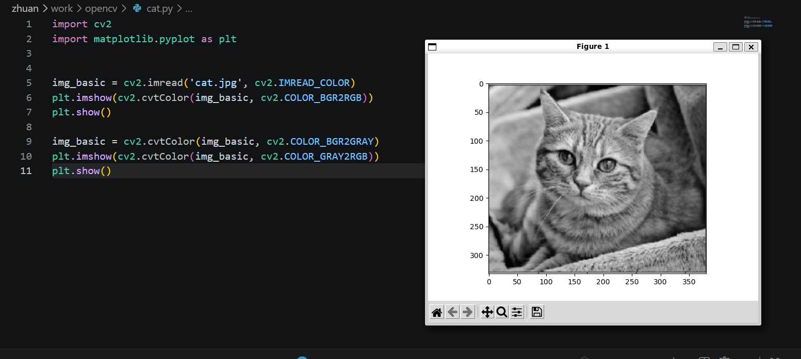
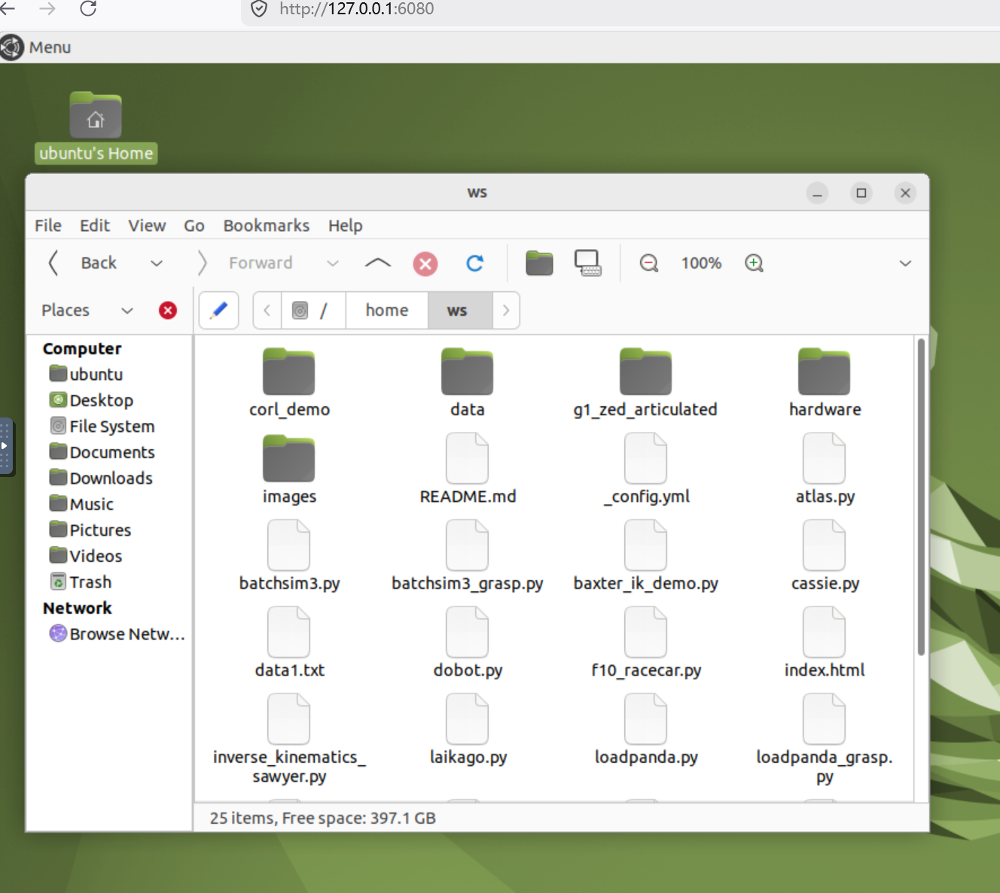

# AI机器人第十周作业
效果图

## 操作步骤
<pre>
1.
在docker环境中使用本地目录运行程序
cd C:\具体要使用的目录
docker run -p 6080:80 --security-opt seccomp=unconfined --shm-size=512m  -v “当前目录$(pwd)/:/home/ws” ghcr.io/tiryoh/ros2-desktop-vnc:humble
2.
安装和运行opencv
pip install opencv-python opencv-contrib-python
</pre>
