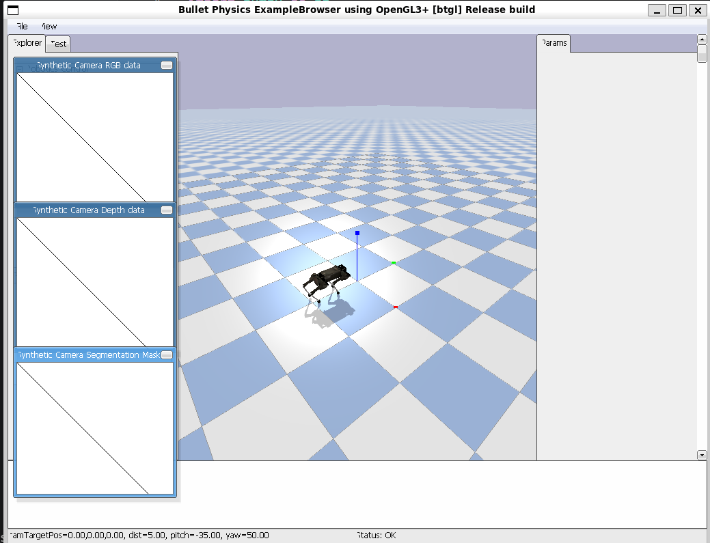
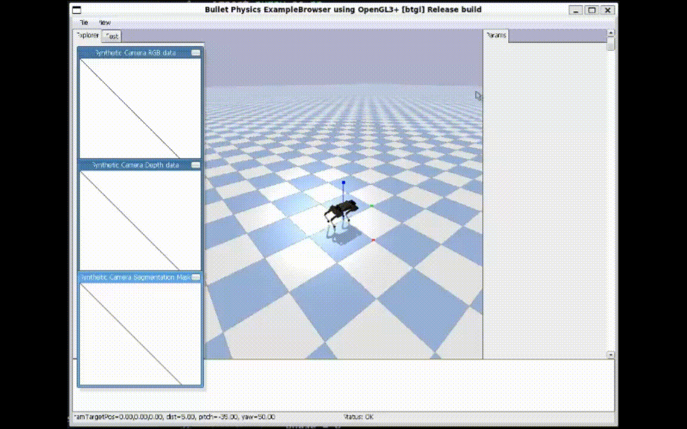

# AI机器人第十二周作业
## 四足机器人入门
### 效果图&演示动画
| 效果图 | 演示动画 |
| ------ | -------- |
|  |  |
### 源代码
<pre><code>
import pybullet as p
import pybullet_data
import time
import numpy as np
import math

class QuadrupedController:
    """简单的四足控制器"""

    def __init__(self, robot_id):
        self.robot_id = robot_id

        # 关节ID（需要根据实际模型调整）
        self.leg_joints = {
            'LF': [0, 1, 2],
            'RF': [3, 4, 5],
            'LH': [6, 7, 8],
            'RH': [9, 10, 11]
        }

        # 步态参数
        self.stance_height = 0.3  # 站立高度
        self.step_height = 0.05   # 抬腿高度
        self.step_length = 0.1    # 步长

    def trot_gait(self, t, leg_name, frequency=1.0):
        """
        Trot步态生成
        """
        # 相位（对角腿同相）
        if leg_name in ['LF', 'RH']:
            phase = 0
        else:  # RF, LH
            phase = np.pi

        # 步态周期位置
        cycle_phase = (2 * np.pi * frequency * t + phase) % (2 * np.pi)

        # 摆动相 vs 支撑相
        if cycle_phase < np.pi:  # 摆动相（腿抬起）
            progress = cycle_phase / np.pi
            x = self.step_length * (progress - 0.5)
            z = self.step_height * np.sin(np.pi * progress)
        else:  # 支撑相（腿着地）
            progress = (cycle_phase - np.pi) / np.pi
            x = self.step_length * (0.5 - progress)
            z = 0

        # 逆运动学（简化版）
        y = 0  # 横向位置
        hip = 0

        # 大腿和小腿角度（简化计算）
        l_thigh = 0.2  # 大腿长度
        l_calf = 0.2   # 小腿长度
        target_height = self.stance_height + z

        # 简化逆运动学
        thigh = np.arctan2(x, target_height)
        calf = -2 * thigh

        return [hip, thigh, calf]

    def step(self, t, frequency=1.0):
        """执行一步控制"""
        for leg_name, joint_ids in self.leg_joints.items():
            target_angles = self.trot_gait(t, leg_name, frequency)

            for joint_id, angle in zip(joint_ids, target_angles):
                p.setJointMotorControl2(
                    self.robot_id,
                    joint_id,
                    p.POSITION_CONTROL,
                    targetPosition=angle,
                    force=20
                )

# 主程序
def main():
    # 初始化
    p.connect(p.GUI)
    p.setAdditionalSearchPath(pybullet_data.getDataPath())
    p.setGravity(0, 0, -9.8)
    p.loadURDF("plane.urdf")

    # 加载机器人
    start_orientation = p.getQuaternionFromEuler([math.pi / 2, 0, math.pi / 2]) # Keeps the robot facing forward
    robotId = p.loadURDF("laikago/laikago_toes.urdf", [0, 0, 0.5],start_orientation)

    # 创建控制器
    controller = QuadrupedController(robotId)

    # 仿真
    t = 0
    dt = 1./240.

    print("开始仿真，按Ctrl+C停止...")

    try:
        while True:
            controller.step(t, frequency=0.5)
            p.stepSimulation()
            time.sleep(dt)
            t += dt

    except KeyboardInterrupt:
        print("仿真结束")

    p.disconnect()

if __name__ == '__main__':
    main()
</code></pre>
## 由于源代码运行的机器狗无法正常走路，以下是修改后的代码
<pre><code>
import pybullet as p
import pybullet_data
import time
import numpy as np
import math

class QuadrupedController:
    """简单的四足控制器"""

    def __init__(self, robot_id):
        self.robot_id = robot_id

        # 关节ID（需要根据实际模型调整）
        self.leg_joints = {
            "RF": [0, 1, 2],
            "LF": [4, 5, 6],
            "RH": [8, 9, 10],
            "LH": [12, 13, 14],
        }

        # 步态参数
        self.stance_height = 0.25  # 站立高度
        self.step_height = 0.05   # 抬腿高度
        self.step_length = 0.12    # 步长

    def trot_gait(self, t, leg_name, frequency=1.0):
        """
        Trot步态生成
        """
        # 相位（对角腿同相）
        if leg_name in ['LF', 'RH']:
            phase = 0
        else:  # RF, LH
            phase = np.pi

        # 步态周期位置
        cycle_phase = (2 * np.pi * frequency * t + phase) % (2 * np.pi)

        # 摆动相 vs 支撑相
        if cycle_phase < np.pi:  # 摆动相（腿抬起）
            progress = cycle_phase / np.pi
            x = self.step_length * (progress - 0.5)
            z = self.step_height * np.sin(np.pi * progress)
        else:  # 支撑相（腿着地）
            progress = (cycle_phase - np.pi) / np.pi
            x = self.step_length * (0.5 - progress)
            z = 0

        # 逆运动学（简化版）
        y = 0  # 横向位置
        hip = 0.15 * x

        # 大腿和小腿角度（简化计算）
        l_thigh = 0.2  # 大腿长度
        l_calf = 0.2   # 小腿长度
        target_height = self.stance_height + z

        # 简化逆运动学
        base_thigh = 0.55
        base_calf = -1.1

        thigh = base_thigh + 2.0 * x - 0.8 * z
        calf = base_calf + 1.5 * z

        return [hip, thigh, calf]

    def step(self, t, frequency=1.0):
        """执行一步控制"""
        for leg_name, joint_ids in self.leg_joints.items():
            target_angles = self.trot_gait(t, leg_name, frequency)

            for joint_id, angle in zip(joint_ids, target_angles):
                p.setJointMotorControl2(
                    self.robot_id,
                    joint_id,
                    p.POSITION_CONTROL,
                    targetPosition=angle,
                    force=120
                )

# 主程序
def main():
    # 初始化
    p.connect(p.GUI)
    p.setAdditionalSearchPath(pybullet_data.getDataPath())
    p.setGravity(0, 0, -9.8)
    p.loadURDF("plane.urdf")

    # 加载机器人
    start_pos = [0, 0, 0.55]
    start_orientation = [0.0, 0.5, 0.5, 0.0] 
    robotId = p.loadURDF("laikago/laikago_toes.urdf", start_pos, start_orientation)

    # 创建控制器
    controller = QuadrupedController(robotId)

    # 仿真
    t = 0
    dt = 1./240.

    print("开始仿真，按Ctrl+C停止...")

    try:
        while True:
            controller.step(t, frequency=0.5)
            p.stepSimulation()
            time.sleep(dt)
            t += dt

    except KeyboardInterrupt:
        print("仿真结束")

    p.disconnect()

if __name__ == '__main__':
    main()
</code></pre>
### 经过修改的代码如下
<pre>
# ==================== 源文件 py.py =====================
    # 加载机器人
    start_orientation = p.getQuaternionFromEuler([math.pi / 2, 0, math.pi / 2]) # Keeps the robot facing forward
    robotId = p.loadURDF("laikago/laikago_toes.urdf", [0, 0, 0.5],start_orientation)

# ==================== 修改后 trot.py ====================
    # 加载机器人
    start_pos = [0, 0, 0.55]
    start_orientation = [0.0, 0.5, 0.5, 0.0] 
    robotId = p.loadURDF("laikago/laikago_toes.urdf", start_pos, start_orientation)
</pre>
Tips: 主要修改了机器狗的初始姿态和初始高度，尽管修改了代码，机器狗可以正常走路，但是是倒着走的，这也是需要进行进一步修改的地方。