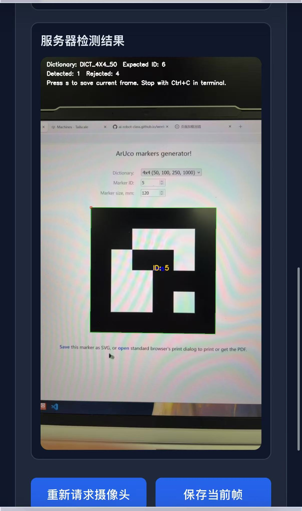

# AI机器人第十三周作业
## 手机摄像头、ArUco 识别
### 效果图

### 操作步骤
<pre>
1. 在WSL和手机中安装Tailscale
2. 给WSL加上 SSH 登录学习测试
 sudo apt update
 sudo apt install openssh-server -y
 sudo service ssh start
确认SSH服务启动
 sudo service ssh status
然后查看Tailscale在WSL中的地址
 tailscale ip -4
3. 安装python库
4. 运行相机接收脚本
5. 用手机浏览器访问页面
当这些操作完成之后就会看到如效果图显示的页面
</pre>