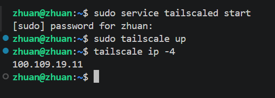
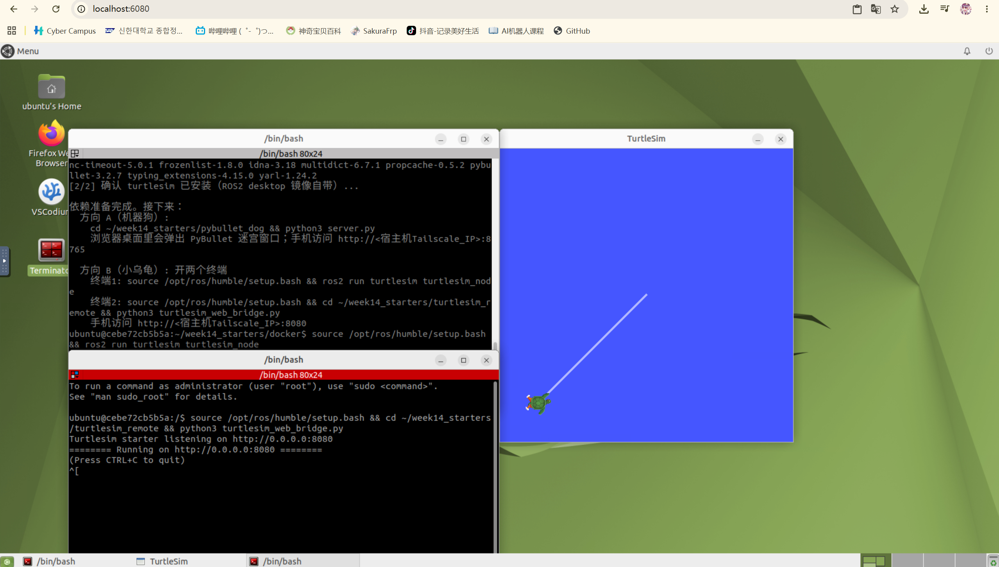
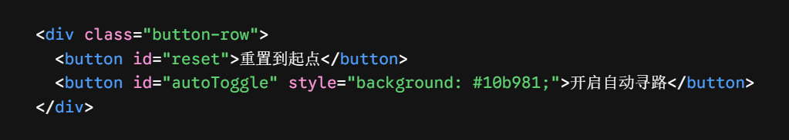
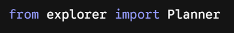
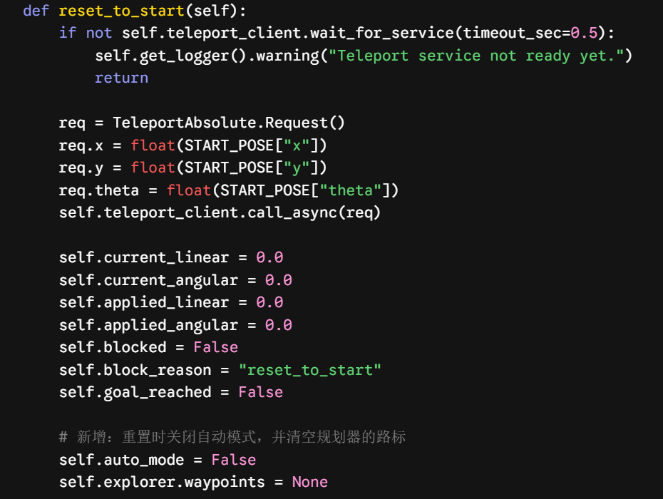

# AI机器人第十四周作业
## 手机遥控 + 局域网通信 + 仿真机器人迷宫探索
### 效果图&演示动画
| 效果图 | 演示动画 |
| ------ | -------- |
|  |  |
## 一、	项目概述
接入explorer.py，实现小乌龟的自动寻路功能，修改了index.html，增加了开启/关闭自动寻路功能的按钮。选择方向B。因为传统“沿墙走”算法在含有环路的复杂迷宫中极易陷入局部死循环或绕远路。为了实现真正意义上的全局最优解，必须采用图论路径规划算法。

## 二．系统链路

1. WSL启动Tailscale
 

2. 手机启动Tailscale并连接

3，Docker启动小乌龟并运行

4.使用手机访问Tailscale的IP后发现已经连接上虚拟机的小乌龟遥控器界面

## 三. 代码改动说明

1. 修改index.html文件增加自动寻路按钮

2.修改turtlesim_web_bridge.py

(1). 导入Planner

(2) 重置函数中关闭自动模式 

## 四. 成果
成果及运行视频见效果图

## 五. 报告书
https://github.com/shizhuanjun/ai-robot-JIN-JIAHAO/blob/main/week14/%E6%8A%A5%E5%91%8A%E4%B9%A6.docx