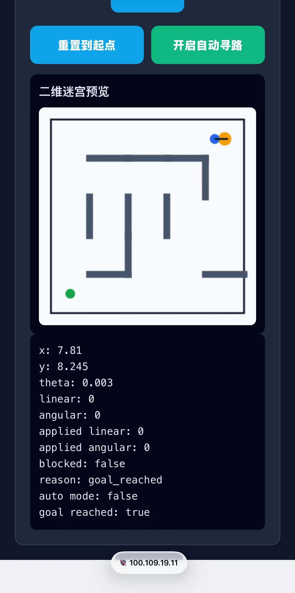
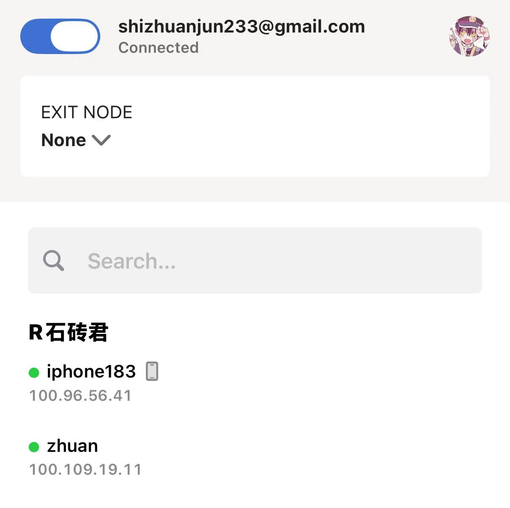
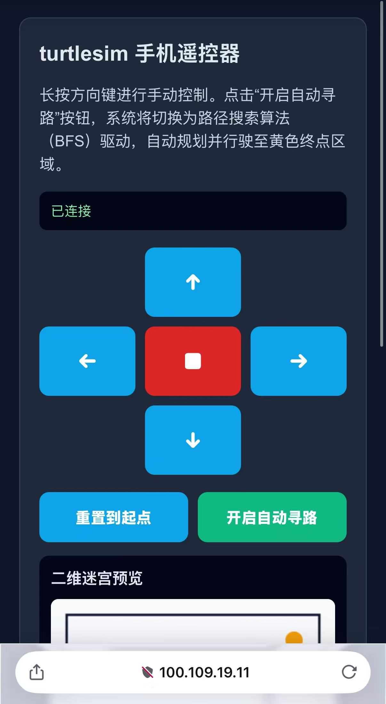

# AI机器人第十四周作业
## 手机遥控 + 局域网通信 + 仿真机器人迷宫探索
### 效果图&演示动画
| 效果图 | 演示动画 |
| ------ | -------- |
|  |  |
## 一、	项目概述
接入explorer.py，实现小乌龟的自动寻路功能，修改了index.html，增加了开启/关闭自动寻路功能的按钮。选择方向B。因为传统“沿墙走”算法在含有环路的复杂迷宫中极易陷入局部死循环或绕远路。为了实现真正意义上的全局最优解，必须采用图论路径规划算法。

## 二．系统链路

1. WSL启动Tailscale
<pre><code>sudo service tailscaled
sudo tailscaled up
</code></pre>
然后运行
<pre><code>tailscale ip -4
</code></pre>
能看见tailscale的ip
<pre>100.109.19.11</pre>

2. 手机启动Tailscale并连接

3，Docker启动小乌龟并运行

（1）第一步：启动 turtlesim
<pre><code>source /opt/ros/humble/setup.bash
ros2 run turtlesim turtlesim_node</code></pre>
 (2) 第二步：另开一个终端，启动网页桥接程序
 <pre><code>source /opt/ros/humble/setup.bash
cd week14_starters/turtlesim_remote
pip install -r requirements.txt
python3 turtlesim_web_bridge.py</code></pre>
 (3) 第三步：打开手机遥控器
 <pre>http://&lt;WSL的Tailscale_IP&gt;:8080</pre>

4.使用手机访问Tailscale的IP后发现已经连接上虚拟机的小乌龟遥控器界面

## 三. 代码改动说明

1. 修改index.html文件增加自动寻路按钮

<pre><code>
&lt;div class="button-row"&gt;
  &lt;button id="reset"&gt;重置到起点&lt;/button&gt;
  &lt;button id="autoToggle" style="background: #10b981;"&gt;开启自动寻路&lt;/button&gt;
&lt;/div&gt;
</code></pre>

2.修改turtlesim_web_bridge.py

(1). 导入Planner

<pre><code>from explorer import Planner
</pre></code>
(2) 重置函数中关闭自动模式 

为了防止重置位置后小乌龟立刻疯狂飙车，在reset_to_start 函数内将自动模式关闭.
<pre><code>
def reset_to_start(self):
    if not self.teleport_client.wait_for_service(timeout_sec=0.5):
        self.get_logger().warning("Teleport service not ready yet.")
        return
    req = TeleportAbsolute.Request()
    req.x = float(START_POSE["x"])
    req.y = float(START_POSE["y"])
    req.theta = float(START_POSE["theta"])
    self.teleport_client.call_async(req)

    self.current_linear = 0.0
    self.current_angular = 0.0
    self.applied_linear = 0.0
    self.applied_angular = 0.0
    self.blocked = False
    self.block_reason = "reset_to_start"
    self.goal_reached = False

    self.auto_mode = False
    self.explorer.waypoints = None
</code></pre>

## 四. 成果
成果及运行视频见效果图

## 五. 报告书
https://github.com/shizhuanjun/ai-robot-JIN-JIAHAO/blob/main/week14/week14.pdf
