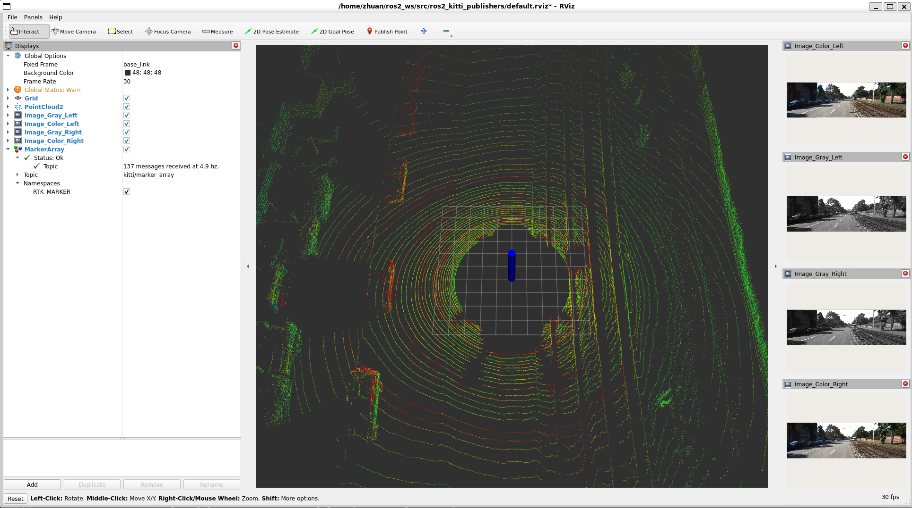
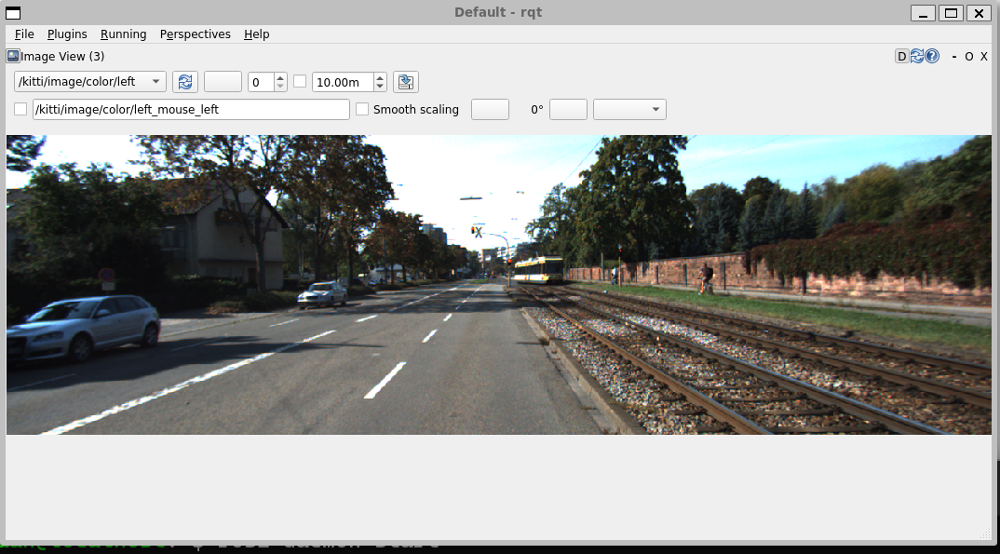

# AI机器人第五周作业
## 效果图

## 操作过程：

1.终端运行
<pre><code>cd ~/ros2_ws
colcon build --cmake-clean-cache
source ./install/setup.bash
ros2 run ros2_kitti_publishers kitti_publishers
</code></pre>
2.另一个终端运行
<pre><code>ros2 daemon start
rqt</code></pre>
